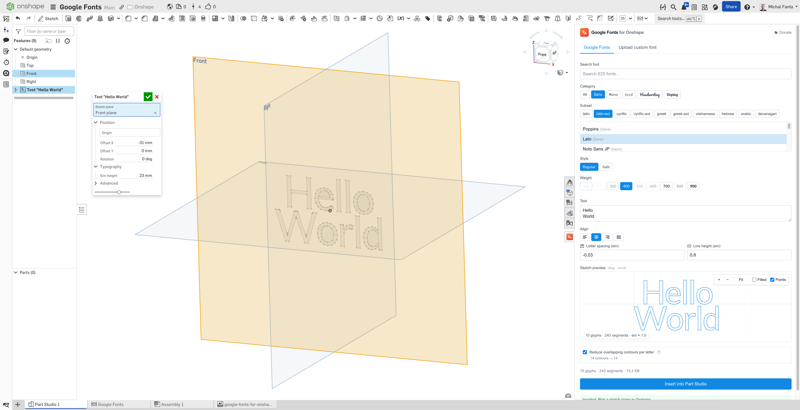

<div align="center">


# Google Fonts for Onshape

**Type that turns into real geometry.**

Bring all 1,900+ Google Fonts — or any `.ttf` / `.otf` you upload — straight into your Part Studio. Pick a face, type your text, click Insert. The result lands on the active sketch plane as native curves you can resize, rotate, and reposition anytime from the standard feature dialog.

[**Add to Onshape — Free**](https://cad.onshape.com/appstore/apps/Utilities/6a0f2d2039092b5cfc0f712a) · [**Live preview**](https://onshape-fonts.xfanta.com/preview) · [**Website**](https://onshape-fonts.xfanta.com)

[](./LICENSE)
[](https://cad.onshape.com/appstore/apps/Utilities/6a0f2d2039092b5cfc0f712a)
[](https://donate.stripe.com/8x2dRafZtcY6fJI6Mj57W01)

</div>

---

<p align="center">
  
</p>

## Why this exists

Onshape ships a small handful of fonts natively. The usual workaround — open Inkscape / Illustrator, export DXF, import into a sketch — is tedious and the imported DXF is **not resizable**: its size is baked in at import time.

This add-in fixes both:

- One panel inside Onshape, every Google Fonts family one click away.
- The geometry lands as native sketch curves, with **em-height, position, and rotation as live feature parameters**. Resize, rotate, reposition from the feature dialog like any built-in feature.

## Features

- **1,900+ Google Fonts** — search by name, filter by category (Sans / Serif / Display / Handwriting / Mono) and by subset (Latin, Cyrillic, Greek, Vietnamese, Arabic, Devanagari, Thai, CJK, …).
- **Upload your own `.ttf` / `.otf`** — drag-drop, parsed locally, never uploaded anywhere.
- **Native sketch geometry** — exact cubic Béziers fitted to the glyph outlines. No DXF detour, no rasterization.
- **Editable after insert** — em-height, sketch plane, origin point, offset X/Y, and rotation stay as live feature parameters.
- **Multi-line text** — Left / Center / Right / Justify alignment, letter spacing, line height.
- **Live preview** — interactive sketch canvas with the actual curves before you click Insert.
- **Works with team & enterprise plans** — uses the standard OAuth + custom feature pipeline.
- **Free, forever** — no accounts, no caps, no upgrade prompts.

## How it works

1. Open any Part Studio in Onshape.
2. Click the **Google Fonts** icon in the right-hand panel.
3. Sign in via Onshape OAuth (one-time).
4. Pick a font, type your text, optionally adjust alignment / spacing.
5. Click **Insert**. A `Google Fonts to Sketch` feature appears in the tree with its dialog open, waiting for you to pick a sketch plane.
6. Pick the plane → the curves land natively in a new sketch.

To change the text, font, or layout: open the panel again and Insert a new feature. The original feature stays untouched.

## Donate

Built and maintained as a free, open-source side project. If it saved you time, consider chipping in:

[**Buy me a coffee →**](https://donate.stripe.com/8x2dRafZtcY6fJI6Mj57W01)

Hosting (Vercel, Upstash KV, Google Fonts API) is cheap but not free — every tip directly funds keeping the lights on and shipping new features.

## License

Source code is available under the [**PolyForm Noncommercial License 1.0.0**](./LICENSE). You may read, fork, study, modify, and redistribute the code for any **noncommercial** purpose — personal projects, learning, research, public-sector use, or other open-source work.

**Selling, hosting as a paid service, or embedding the code in any commercial product is not permitted under this license.** For commercial licensing, open a GitHub issue.

---

## Tech stack (for the curious)

- **Next.js 16** + TypeScript + Tailwind on **Vercel**
- **opentype.js** — font parsing → cubic Bézier extraction
- **FeatureScript** custom feature (`featurescript/googleFontsToSketch.fs`) consumed via the Onshape REST API
- **paper.js** (paper-core) — optional boolean union for overlapping glyph subpaths
- **Vercel KV** (Upstash Redis) — OAuth token storage + Google Fonts API list cache
- **iron-session** — signed cookie session

## Run locally

```bash
pnpm install
pnpm dev
```

Open <http://localhost:3000/preview> — that's the standalone preview that doesn't need any Onshape setup. Type some text, pick or upload a font, see the curves. You can export the result as SVG / DXF / JSON.

To run the full Onshape-integrated experience locally (OAuth, panel iframe, feature insert), you need:

1. A published Onshape Feature Studio with `googleFontsToSketch.fs` committed and a version cut.
2. An OAuth app registered in the [Onshape Dev Portal](https://dev-portal.onshape.com/oauthApps) with redirect `http://localhost:3000/api/oauth/callback`.
3. A `.env.local` populated from `.env.example` (Onshape client ID/secret, FS document IDs, optionally a Google Fonts API key, KV credentials).

See [`AGENTS.md`](./AGENTS.md) for the breaking-change-friendly Next.js 16 notes, and the `featurescript/` directory for the FS source.

## Project layout

```
src/
  app/
    page.tsx                    # landing page
    preview/page.tsx            # standalone text → curves preview
    panel/page.tsx              # iframe panel embedded in Onshape
    api/
      oauth/{start,callback,status}/route.ts
      feature/{add,list}/route.ts
      google-fonts/{list,file}/route.ts
  components/
    FontPicker.tsx              # Google Fonts list + upload + text + style
    SketchViewer.tsx            # interactive zoom/pan canvas
    SiteShell.tsx               # header + footer
  lib/
    textToCurves.ts             # opentype.js → cubic Bézier JSON (wire format v2)
    onshape.ts                  # REST client + add-feature body
    googleFonts.ts              # Google Fonts Dev API client + 3-tier cache
    mergeContoursPaper.ts       # paper.js boolean reduce
    exporters.ts                # SVG / DXF emit
    session.ts                  # iron-session
    tokenStore.ts               # Vercel KV / in-memory
    env.ts                      # zod-validated env config
featurescript/
  googleFontsToSketch.fs        # the published Onshape feature
fixtures/                       # JSON fixtures for manual FS testing
public/screenshots/             # images used on the landing page + this README
public/logo-brand-512.png       # brand mark used in the README header
```

## Author

[Michal Fanta](https://xfanta.cz) · [michal.fanta@xfanta.cz](mailto:michal.fanta@xfanta.cz)

Issues, feature requests, and pull requests welcome.
